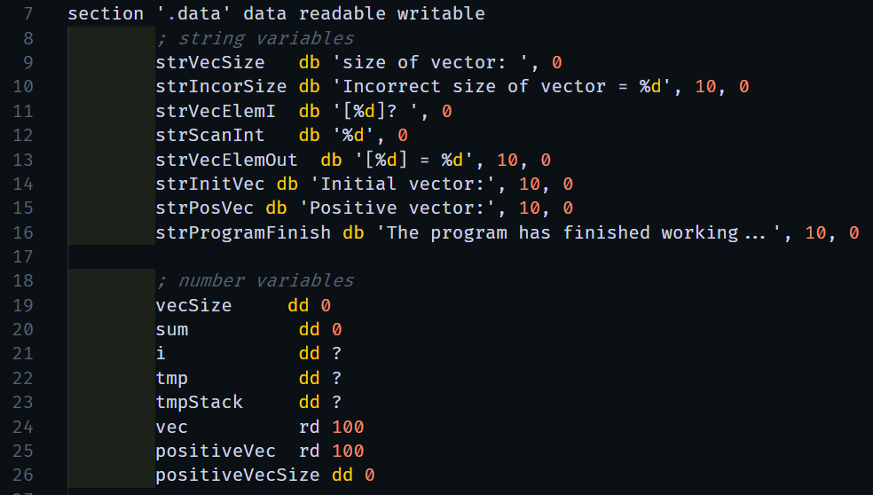
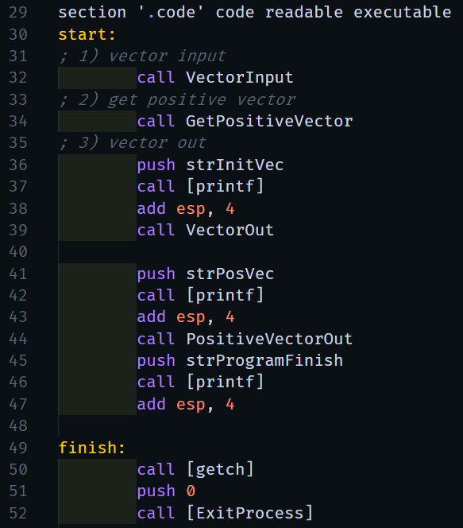
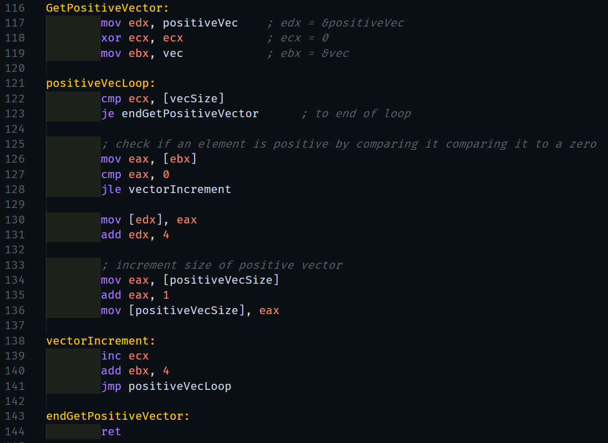
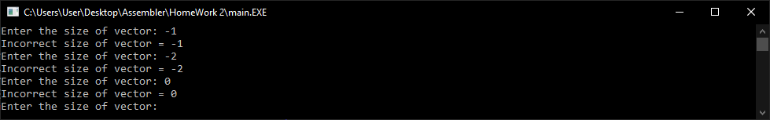
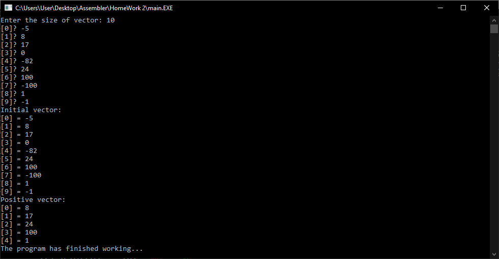

# Домашнее задание №2

> Разработка на языке ассемблера программы для обработки одномерных массивов, 05.10.2020

---

## Условие задания (вариант №1)

> Разработать программу, которая вводит одномерный массив `A[N]`, формирует из элементов массива A новый массив B по правилам, указанным в таблице, и выводит его. Память под массивы может выделяться как статически, так и динамически по выбору разработчика. **Массив `B` состоит из положительных элементов `А`**.

## Отчёт о работе

В качестве базового кода была взята программа, представленная в качестве примера на сайте: [softcraft.ru](http://www.softcraft.ru/edu/comparch/practice/asm86/03-subprog/sum2-32/sum.asm)

 

### Компоненты программы

Программу состоит из следующих компонентов-процедур:

-   Секция с объявлением используемых данных
    

-   Секция с основным кодом программы
    

-   Процедура VectorInput для ввода массива `A`

-   Процедура GetPositiveVector для формирования массива `B`
    

-   Процедура VectorOut для вывода массива `A`

-   Процедура PositiveVectorOut для вывода массива `B`

### Тестирование программы

1. Ввод некорректной длины массива `A`
   

1. Массив из 10 чисел
   
