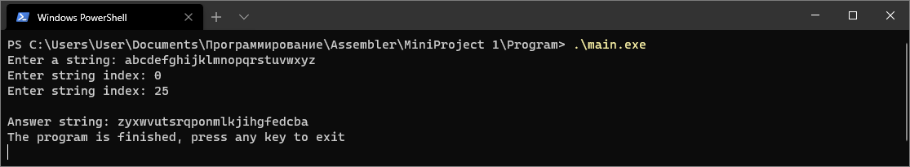
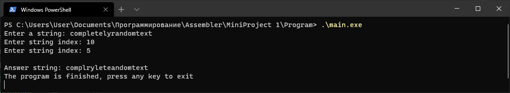
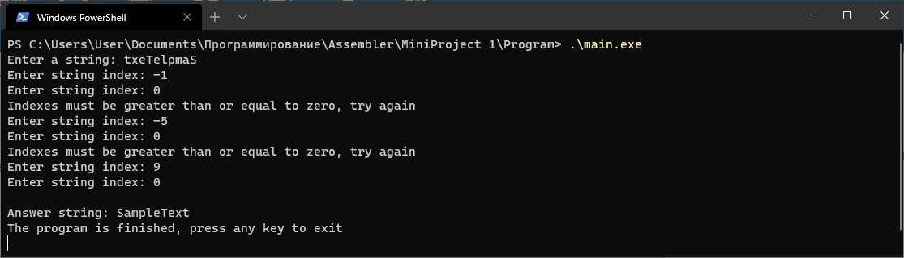
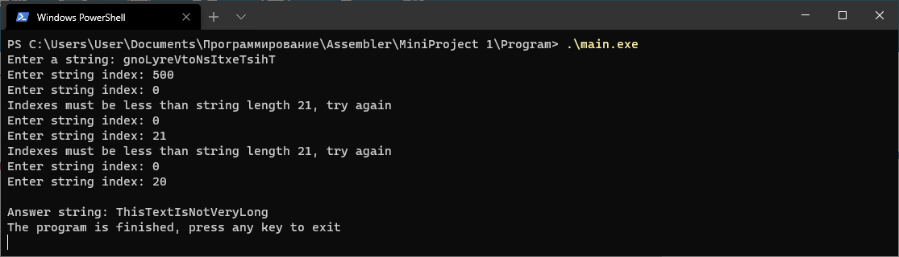
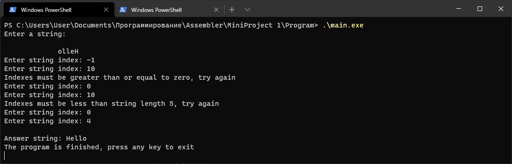
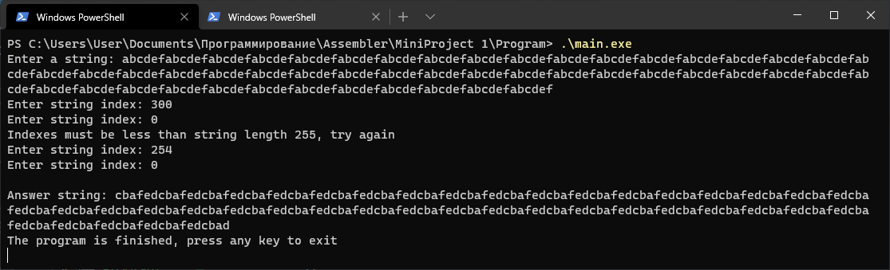

# Минипроект №1

## Условие задания (вариант №1)

> Разработать программу, которая "переворачивает" заданную позициями `N1-N2` часть **ASCII-строки символов**

## Отчёт о работе

Код программы находится в директории `Program`
 
Пояснительная записка с отчетом о работе располагается файл `Пояснительная записка.pdf`

## Тестирование программы

1. Стандартный ввод
   

1. Стандартный ввод, но первый введенный индекс больше второго
   
   В данном случае программа поменяет местами первый и второй индексы и отработает корректно

1. Некорректные данные, отрицательные индексы
   
   Если один из введенных индексов отрицателен, программа вернется к моменту их ввода

1. Некорректные данные, индексы больше или равны длине строки
   
   Если один из введенных индексов больше или равен длине строки, программа укажет длину строки и вернется к моменту ввода индексов

1. Ввод пустой строки и пробельных символов
   
   Ввод пустой строки и пробелов невозможен в силу специфики функции языка C `scanf`, считывающей только значимые символы. Программа работает корректно.

1. Ввод длинной строки
   
   В случае ввода строки большей длины, чем установлено программой (255), возьмутся первые 255 символо строки. Программа работает корректно.
